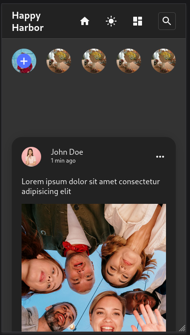

<!-- will this work? This worked -->

# Happy Harbor

Social Site made with React, Node and Postgres

## Screenshots

 
Login Page 
 
Register Page 
 
Homepage Dark 
 
Homepage Light 
 
Profile Dark 
 
Profile Light 
 
Mobile UI 
